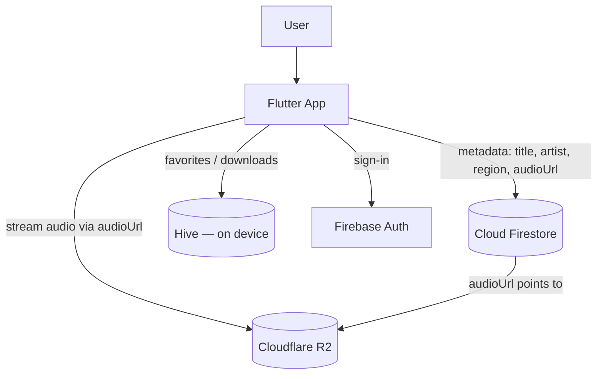
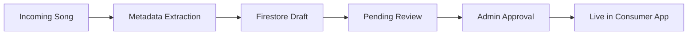
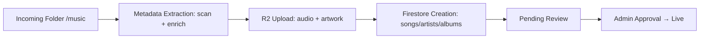

# HimRaag

### Preserving Pahadi Culture Through Music

[](https://flutter.dev)
[](https://riverpod.dev)
[](https://firebase.google.com/products/auth)
[](https://firebase.google.com/products/firestore)
[](https://developers.cloudflare.com/r2/)
[](https://developer.android.com)
[](https://flutter.dev/multi-platform/web)
[](#23-license)

> A free, culturally-focused streaming platform dedicated **exclusively** to the
> folk music of the Himalayan hills — no Bollywood, no filler — built to preserve
> and promote Pahadi heritage for everyday listeners, including offline.

---

## 1. Project Overview

**HimRaag** ("हिमराग" — the melody of the snows) is a mobile music platform built
to **preserve and promote Pahadi folk music** — songs that rarely reach
mainstream streaming services and risk being lost to time.

Most streaming apps treat regional folk as an afterthought. HimRaag is the
opposite: a dedicated home for the music of the hills, with first-class
discovery by **region**, **language**, and **artist**. It is engineered to run
on a near-zero monthly budget (Firebase free tier + Cloudflare R2's
zero-egress storage) so it can stay free for listeners and sustainable for a
small team.

It is a dedicated platform for:

| Region | Language / Dialect |
|---|---|
| **Garhwali** | Garhwali |
| **Kumaoni** | Kumaoni |
| **Jaunsari** | Jaunsari |
| **Himachali** | Himachali / Pahari |
| **Kinnauri** | Kinnauri |
| **Sirmauri** | Sirmauri |

**Principles:** only licensed / rights-cleared Pahadi content · free for users ·
artist-first discovery · offline-capable · culturally respectful.

---

## 2. Features

### 📱 Consumer App
- **Music Streaming** — audio streamed on demand from Cloudflare R2.
- **Background Playback** — lock-screen / notification controls (`just_audio_background`).
- **Search** — songs, artists, and albums (prefix + substring).
- **Artist Pages** — bio, region, and full discography.
- **Album Pages** — track listings with artwork.
- **Favorites** — save songs locally.
- **Downloads** — save tracks to the device for offline use.
- **Offline Playback** — play downloaded tracks with no connection.
- **Region Discovery** — browse by Pahadi region and language.

### 🛠️ Admin Dashboard (Flutter Web)
- **Metadata Review** — queue of imported tracks needing attention.
- **Import Management** — bulk-import catalog JSON, validate before commit.
- **Artist Management** — create / edit / verify artist profiles.
- **Album Management** — create / edit albums and reassign tracks.
- **Content Moderation** — approve / reject / publish, with an audit log.

### 🎤 Artist Dashboard
- **Artist Profile** — manage your own profile.
- **Song Submission** — submit tracks for review.
- **Album Submission** — group submissions into albums.
- **Analytics** — listener / play insights for your catalog.

---

## 3. Screenshots

> _Placeholders — drop real captures into `docs/screenshots/`._

| Home | Player | Search |
|---|---|---|
|  |  |  |

| Album | Artist | Admin Dashboard |
|---|---|---|
|  |  |  |

---

## 4. Tech Stack

| Layer | Technology |
|---|---|
| UI / Framework | **Flutter** (Android + Web admin) |
| State management | **Riverpod 2.x** |
| Authentication | **Firebase Auth** (Google Sign-In, email/password, anonymous) |
| Metadata database | **Cloud Firestore** |
| Audio + artwork storage | **Cloudflare R2** (S3-compatible, zero egress) |
| Audio playback | **just_audio** + **just_audio_background** |
| Local / offline storage | **Hive** |
| Navigation | **GoRouter** |
| Downloads / networking | **Dio** |

---

## 5. Architecture



The app reads lightweight **metadata** from Firestore (and a bundled fallback
catalog), then streams the actual **audio bytes** directly from Cloudflare R2
using the `audioUrl` on each song document. No audio is bundled in the APK.

---

## 6. Firebase Architecture

**Project:** `himraag-prod`

| Collection | Purpose |
|---|---|
| `songs` | track metadata + `audioUrl`/`artworkUrl` (R2), approval + search fields |
| `albums` | album metadata, artwork, region/language |
| `artists` | artist profiles, region, verification state |
| `users` | account profile + roles |
| `playlists` | user-curated playlists |
| `analytics` | play / engagement events |
| `auditLogs` | moderation + import audit trail |

Representative `songs` document:
```jsonc
{
  "title": "Main Pahadan",
  "titleLowercase": "main pahadan",
  "artistName": "Diksha Dhaundiyal, Pooja Dhaundiyal",
  "albumTitle": "Diksha Dhaundiyal, Pooja Dhaundiyal — Singles",
  "region": "Kumaoni",
  "language": "Kumaoni",
  "genre": "Folk",
  "audioUrl":   "https://pub-….r2.dev/audio/main-pahadan-….mp3",
  "artworkUrl": "https://pub-….r2.dev/artwork/main-pahadan-….png",
  "durationMs": 336000,
  "license": "LICENSED",
  "isApproved": true,
  "isPublished": true,
  "reviewRequired": false,
  "approvalStatus": "approved",
  "searchKeywords": ["main pahadan", "main", "pahadan", "diksha", "kumaoni"]
}
```

---

## 7. Cloudflare R2 Architecture

R2 is an S3-compatible object store with **zero egress fees**, which is the key
reason it was chosen for a free-to-users music app.

```
himraag-audio (bucket)
├── audio/      <slug>.mp3   — track audio (source of truth)
├── artwork/    <slug>.png   — cover art
├── artists/    <slug>.png   — artist images
└── albums/     <slug>.png   — album covers
```

- **MP3 storage** — every track lives at `audio/<slug>.mp3`.
- **Artwork storage** — covers at `artwork/<slug>.png` (artist/album art mirrored).
- **Public delivery** — served over the public R2 domain (`https://pub-….r2.dev`),
  cached at Cloudflare's edge.
- **Cost benefits** — **no egress charges**; storage is a few cents/GB/month.
- **Scalability** — object storage scales horizontally with no per-stream cost,
  so bandwidth growth doesn't grow the bill.

---

## 8. Content Moderation Workflow



Imported content lands as a **draft** (`approvalStatus=pending`,
`reviewRequired=true`, `isApproved=false`) and only becomes consumer-visible
after an admin approves it (`isApproved=true`, `isPublished=true`).

---

## 9. Metadata Review Workflow

Imported audio frequently arrives with **no embedded tags**. The Metadata Review
section surfaces every flagged track and lets a moderator fix it:

- **Missing metadata** — tracks tagged `needs-metadata-review` (or with a
  `Needs Review` region/language sentinel) appear in the queue.
- **Artist assignment** — assign or create the correct artist (id + lowercase +
  search fields regenerated automatically).
- **Album assignment** — assign or create the album; tracks regroup accordingly.
- **Approval flow** — once region / language / artist resolve, the review tag is
  dropped and the track can be approved → published.

---

## 10. Search Architecture

Search runs **without** a paid search service (no Algolia), combining two cheap
strategies and merging the results:

- **`titleLowercase`** — a normalized field enabling Firestore **prefix** range
  queries (`>= q` and `<= q + sentinel`).
- **`searchKeywords`** — an array of normalized tokens (title + artist + album +
  region + language) enabling `array-contains` **token** matching.
- **Prefix search (remote)** — fast Firestore range query on `titleLowercase`.
- **Substring search (local)** — the bundled catalog is also searched with a
  case-insensitive `contains`, catching mid-word matches the prefix query misses.

The app **merges** local-substring + remote results, so a query like `salma`
finds *Meri Salma* even though it isn't a title prefix.

---

## 11. Security

- **Firebase Auth** — Google Sign-In, email/password, and anonymous guest mode.
- **Admin claims** — dashboard access is gated on Firebase custom claims
  (`{ admin: true }` / `{ role: 'artist' }`), set via `scripts/set_claims.js`.
- **Firestore Rules** — `firestore.rules` enforces the same claims server-side;
  consumers can only read approved/published content, writes require the admin claim.
- **R2 isolation** — the bucket exposes only public **read** on `audio/` and
  `artwork/`; write credentials live only in the gitignored `.env/` folder and
  are never bundled into the app or committed.

---

## 12. Scalability

| Catalog size | How it holds up |
|---|---|
| **100 songs** | Trivial — single Firestore reads, instant. |
| **1,000 songs** | Prefix / `array-contains` queries + pagination stay fast. |
| **10,000 songs** | Firestore indexes scale automatically; R2 unaffected. |
| **100,000 songs** | Metadata cost scales with reads (cacheable); audio cost is **flat** because R2 has zero egress. |

**Why Firestore + R2?** Firestore gives cheap, indexed, real-time metadata with
no server to run. R2 gives object storage with **no egress fees**, so streaming
bandwidth — the cost that normally explodes for a music app — stays effectively
free. Together they let HimRaag scale catalog and listeners without scaling the
bill.

---

## 13. Folder Structure

```
HimRaag/
├── lib/
│   ├── admin/                 # Flutter Web admin dashboard
│   │   └── screens/           # dashboard, catalog, import, review, song editor, login
│   ├── artist/                # artist dashboard
│   ├── core/                  # config, constants, router, theme, validation, shell
│   ├── data/
│   │   ├── local/             # Hive boxes + bundled catalog datasource
│   │   ├── remote/            # Firestore datasources + DTOs
│   │   └── services/          # audio player, downloads
│   ├── domain/models/         # Song, Album, Artist, Playlist, …
│   ├── features/              # home, search, player, library, songs, auth
│   ├── firebase_options.dart
│   └── main.dart
├── scripts/                   # import + R2 + Firestore pipeline (Node)
│   ├── scan_audio.js          # audio metadata scan
│   ├── enrich_metadata.js     # filename/web enrichment + confidence
│   ├── r2_upload.js           # R2UploadService / ArtworkUploadService / BulkImportPipeline
│   ├── generate_import_catalog.js
│   ├── import.js              # validate + commit to Firestore
│   ├── approve_imported.js    # approve + make live
│   ├── set_claims.js          # admin/artist custom claims
│   └── verify_*.js            # Firestore / end-to-end verification
├── assets/
│   ├── catalog/               # bundled metadata catalog (R2 URLs)
│   ├── images/ icons/ fonts/ animations/
├── android/                   # Android project
├── web/                       # web entry
├── integration_test/          # device playback tests
├── test/                      # unit/widget tests
├── docs/                      # documentation + screenshots
├── firestore.rules            # Firestore security rules
├── storage.rules
└── pubspec.yaml
```

---

## 14. Local Setup

```bash
# 1. install dependencies
flutter pub get

# 2. wire up Firebase (generates lib/firebase_options.dart + google-services.json)
dart pub global activate flutterfire_cli
flutterfire configure --project=himraag-prod

# 3. run the consumer app on a device/emulator
flutter run
```

---

## 15. Admin Dashboard Setup

```bash
flutter run -d chrome -t lib/admin/main_admin.dart
```
Sign in with an account that holds the `{ admin: true }` custom claim. Grant it via:
```bash
GOOGLE_APPLICATION_CREDENTIALS=<service-account.json> \
  node scripts/set_claims.js --email you@example.com --role admin
```

---

## 16. Artist Dashboard Setup

The artist dashboard lives at `lib/artist/artist_dashboard.dart` and is reached
by users holding the `{ role: 'artist' }` claim. Grant with:
```bash
GOOGLE_APPLICATION_CREDENTIALS=<service-account.json> \
  node scripts/set_claims.js --email artist@example.com --role artist
```

---

## 17. Environment Variables

Secrets live in the gitignored **`.env/`** folder and are loaded at runtime by
`scripts/lib/credentials.js` — never printed, logged, or committed.

| Variable / file | Used by | Purpose |
|---|---|---|
| `.env/<cloudflare>.txt` | R2 scripts | Account ID, Bucket Name, Access Key ID, Secret Access Key, Public URL |
| `.env/<firebase-adminsdk>.json` | Firestore/admin scripts | Firebase service-account |
| `GOOGLE_APPLICATION_CREDENTIALS` | `import.js`, `set_claims.js`, `verify_*.js` | path to the service-account JSON |
| `HIMRAAG_INTERNAL` (build define) | app | `true`/`false` — include demo content |

App-side build config:
```bash
flutter build apk --release --dart-define=HIMRAAG_INTERNAL=false
```

---

## 18. Import Pipeline



Reproducible end to end:
```bash
node scripts/scan_audio.js "<music folder>"        # extract durations + tags
node scripts/generate_audit_report.js              # AUDIO_AUDIT_REPORT.md
node scripts/enrich_metadata.js                    # METADATA_ENRICHMENT_REPORT.md
node scripts/r2_upload.js                           # upload + verify → R2_UPLOAD_REPORT.md
node scripts/generate_import_catalog.js            # catalog + firestore_import.json
GOOGLE_APPLICATION_CREDENTIALS=<sa.json> \
  node scripts/import.js --json scripts/seed_data/firestore_import.json --commit
GOOGLE_APPLICATION_CREDENTIALS=<sa.json> \
  node scripts/approve_imported.js                  # approve + make live
```

---

## 19. Deployment Guide

**Android**
```bash
flutter build apk --release        # build/app/outputs/flutter-apk/app-release.apk
flutter build appbundle --release  # build/app/outputs/bundle/release/app-release.aab
```

**Firebase**
```bash
firebase deploy --only firestore   # rules + indexes
```

**Cloudflare R2**
- Ensure the bucket has **public read** on `audio/` and `artwork/`.
- Confirm the shipped catalog's public base URL matches production.

---

## 20. Play Store Release Guide

See **[`PLAYSTORE_DEPLOYMENT_GUIDE.md`](PLAYSTORE_DEPLOYMENT_GUIDE.md)** for the
full walkthrough: release signing, Play Console setup, privacy policy, content
declarations (music rights!), testing tracks, and staged production rollout.

---

## 21. Roadmap

- [ ] iOS build.
- [ ] Lyrics + synced lyrics view.
- [ ] Playlist sharing.
- [ ] Artist self-serve verification.
- [ ] Richer analytics for artists.
- [ ] In-app artist submissions → review queue.
- [ ] Curated editorial collections by festival / season.

---

## 22. Contributors

- **Sumit Chauhan** — creator & maintainer ([@Gosling-dude](https://github.com/Gosling-dude))

Contributions welcome — open an issue or PR. Please keep content strictly Pahadi
and rights-cleared.

---

## 23. License

Proprietary — © HimRaag. All rights reserved. Music content is licensed /
rights-cleared per track and is not redistributable. Contact the maintainer for
usage permissions.
